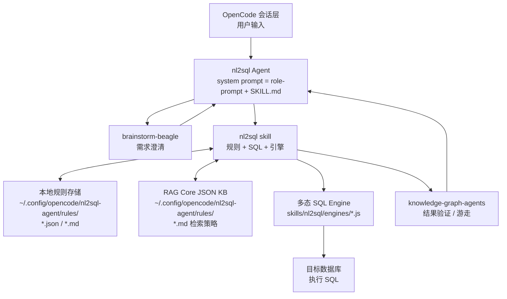

# NL2SQL Agent for OpenCode 设计文档

## 1. 目标

为 OpenCode 增加一个以 **自然语言转 SQL（NL2SQL）** 为核心能力的 Agent。用户通过自然语言描述数据需求，Agent 在多轮交互中完成：

1. 需求澄清与规则初始化。
2. 查询拆解与隐含信息挖掘。
3. 基于数据库规则生成可执行的 SQL。
4. 通过知识图谱验证结果合理性。
5. 不合理时向用户确认并重新生成 SQL。

Agent 以 **npm 包 + OpenCode v2 插件** 形式交付，安装后即可在 OpenCode 中作为 `nl2sql` Agent 使用。

## 2. 核心能力拆解

| 阶段 | 负责能力 | 说明 |
|------|----------|------|
| 需求澄清 / 规则生成 | `brainstorm-beagle`（SkillHub） | 多轮对话，产出数据库专属 **spec**（WHAT/WHY）：业务目标、相关表、别名映射、典型示例、字段经验；`nl2sql` Agent 将其转化为规则条目 |
| 查询拆解 / 隐含挖掘 | `nl2sql` Agent 内置 `role-prompt.md` + `brainstorm-beagle` | 把模糊 query 拆成多个明确子 query，补全隐含条件（“最近”→时间范围、“高”→阈值、“女性”→gender 映射）；必要时按 brainstorm-beagle 原则澄清 |
| 规则召回 | `nl2sql` skill 内部 | 按 `database_id` + `rule_type` 召回；支持本地 JSON 文件或 RAG Core JSON 知识库 |
| SQL 生成 | `nl2sql` skill 内部 | 基于召回规则将自然语言子 query 转换为目标数据库 SQL |
| SQL 执行 | `nl2sql` skill 的 SQL Engine | 多态引擎：MySQL / PostgreSQL / SQLite，按数据库 `type` 自动选择 |
| 结果验证 | `knowledge-graph-agents`（SkillHub） | 将结果凝练为知识图谱，通过 **Spreading Activation（2-hop 遍历）** 判断结果合理性 |
| 失败处理 | `nl2sql` Agent | 发现矛盾时向用户确认缺失/歧义信息，回到拆解或规则召回阶段重新生成 |

## 3. 设计原则：Skill 原子化

- **每个 skill 是独立原子**：`skills/nl2sql/SKILL.md` 只描述 `nl2sql` skill 本身的能力（规则、引擎、SQL 生成、结果格式），不引用 `brainstorm-beagle` 或 `knowledge-graph-agents`。
- **Agent 负责协同**：`src/role-prompt.md` 是 `nl2sql` Agent 的 system prompt，专门描述三个 skill 何时被调用、如何组合。
- **不修改第三方 skill**：`brainstorm-beagle` 和 `knowledge-graph-agents` 保持原样，仅通过 `skills/` 目录加载。

## 4. 总体架构



> 说明：本地规则与 RAG Core 检索策略文件均位于 `~/.config/opencode/nl2sql-agent/rules/`；RAG Core 模式下原始规则 JSON 文档存储在 RAG Core KB 中。

## 5. 数据流

### 5.1 初始化（首次连接某个数据库）

1. 用户提供：数据库类型、连接信息（IP/端口/账号/密码/库名或 SQLite 文件）、自然语言业务诉求。
2. Agent 通过 `brainstorm-beagle` 与用户进行多轮对话，产出**数据库规则 spec**（WHAT/WHY 级别，不包含具体实现）。对话过程遵循：
   - 一次一个问题，鼓励用户先自由表达，再挑战模糊点（“最近”具体指多久？），把抽象概念具体化（“举个例子？”）。
   - 必要时给出 2-3 个产品方向/范围取舍，确认当前 scope 后再继续。
   - 使用多选题降低用户决策成本，选项避免泛泛分类（如“技术/业务/其他”）。
   - 检查已有规则库是否已覆盖相关能力（prior-art check），避免重复规则。
   - 最终收集（以 spec 形式记录，具体规则转换见 5.3）：
     - 相关表及其 DDL
     - 专用名词/别名与自然语言映射（如 `gender=1` 表示男性）
     - 典型 query→sql 示例
     - 字段经验 / 业务常识（如“女性身高一般不超过 170cm”）
   - 定稿前使用 `brainstorm-beagle` 自带的 `references/spec-reviewer.md` 进行自检：无 TBD/TODO 占位、需求可验证、决策有理由、约束与需求无冲突。
   - 只产出 **spec（WHAT/WHY）**，不写代码、不生成实现计划；具体规则条目由 `nl2sql` skill 在 5.3 中转换。
3. 为本次数据库配置生成唯一 `database_id`（UUID 或用户自定义可读 ID，全局唯一）。
4. 在 `~/.config/opencode/nl2sql-agent/databases.json` 中记录数据库配置，并指定 `rule_storage`：
   - `local`：规则存储在 `~/.config/opencode/nl2sql-agent/rules/<database_id>.json` + `<database_id>.md`。
   - `rag_core`：规则拆散为 JSON 文档存入 `euler-copilot-rag/rag_core` 的 JSON 知识库；本地 `~/.config/opencode/nl2sql-agent/rules/<database_id>.md` 仅作为**检索策略**。
5. 使用 `nl2sql` skill 将 spec 转换为规则条目（`ddl` / `mapping` / `example` / `experience`），并按 `rule_storage` 写入：
   - **local**：将规则数组写入 `<database_id>.json`，生成对应的 Markdown 聚合文档。
   - **RAG Core**：先创建 JSON 类型 KB 拿到 `kb_id`，逐条写入规则（`is_immediate: true`），最后生成本地检索策略 Markdown。

### 5.2 查询（用户输入自然语言 query）

1. Agent 按 `role-prompt.md` 中定义的职责拆解 query，挖掘隐含信息；必要时再次调用 `brainstorm-beagle` 澄清。澄清方式遵循该 skill 原则：一次一个问题、多选题优先、把抽象需求具体化（“举个例子？”）。
2. 按 `database_id` + `rule_type` 召回规则：
   - `ddl` → 表结构
   - `mapping` → 别名与映射关系
   - `example` → 相似 query→sql 示例（few-shot）
   - `experience` → 字段经验 / 约束
3. 生成候选 SQL（默认只读 `SELECT`）。
4. 通过多态 SQL Engine 执行 SQL，获取结果。
   - 若执行失败（语法错误、连接异常等），向用户报告错误原因并回到步骤 2 重新生成，或请求用户提供修正建议。
5. 将结果关键数据凝练为知识图谱（建图细节详见 9.1）：从 SQL 行中提取命名实体（如用户、产品、项目）作为节点，数值与日期作为属性，根据表间关系和经验规则构建边（如 `用户-拥有-订单`、`订单-包含-产品`）。
6. 调用 `knowledge-graph-agents` 进行验证（验证细节详见 9.1）：
   - 选择**种子节点**：用户 query 中提到的核心实体。
   - 使用 **Spreading Activation（2-hop 遍历）** 从种子节点向外扩散，检查邻居节点。
   - 结合 `experience` 规则，检查是否存在明显矛盾：
     - 数值超出经验范围（如女性身高 > 170cm）。
     - 关系缺失（如订单没有对应用户）。
     - 时间冲突（如 `updated_at < created_at`）。
    - 状态不一致（如已删除用户仍有活跃订单）。
   - 对常见命名实体类型（Person / Organisation / Place / Event / Product / Project / System）可优先创建 `CO_OCCURS` 共现边，避免给所有值建边导致边爆炸。
7. 合理 → 返回 SQL + 结果摘要。
8. 不合理 → 向用户报告矛盾并询问缺失/歧义信息，回到步骤 1 或 2 重新生成；若发现规则缺失/过时，也可回到 5.1 初始化流程或按 5.4 更新规则库。

### 5.3 brainstorm-beagle spec 到 nl2sql 规则的映射

`brainstorm-beagle` 产出的是一份 **WHAT/WHY spec**，不是直接的规则文件。`nl2sql` Agent 需要将其中的关键信息提取并转化为 6.1 中的四种规则类型：

| spec 章节 | 典型内容 | 转化后的规则类型 |
|-----------|----------|------------------|
| **Problem Statement / Core Value** | 这个数据库要解决什么业务问题 | 作为数据库规则文档的顶层 `description`，或写入一条 `experience` 规则保存业务背景 |
| **Requirements**（must/should） | 必须支持哪些查询意图 / 非功能约束 | 查询意图拆分为多条 `example` 规则；非功能约束（只读、权限、时间窗口等）写入 `experience` 或数据库配置 |
| **Key Decisions** | 专用名词映射、范围约定、阈值定义 | 拆分为 `mapping` 和 `experience` 规则 |
| **Constraints** | 硬限制（如只读、时间范围、枚举值） | 拆分为 `experience` 规则或 `mapping` 规则 |
| **Open Questions** | 未明确的假设 | 在初始化完成前必须澄清，不能转化为规则；保留到 `Future Considerations` |
| **Future Considerations** | 后续阶段需求 | 不写入当前规则库，仅记录 |

**示例转化**：

- spec 片段：`"gender=1 表示男性，gender=2 表示女性，这是系统历史约定。"`
  - 转化为 `mapping` 规则：
    ```json
    { "database_id": "xxx", "rule_type": "mapping", "mapping_type": "correspondence",
      "table": "users", "col": "gender", "description": "1=男，2=女" }
    ```
- spec 片段：`"查询时用户说‘女性’，即 users.gender = 2。"`
  - 转化为 `mapping` 规则：
    ```json
    { "database_id": "xxx", "rule_type": "mapping", "mapping_type": "synonym",
      "table": "users", "col": "gender", "description": "女性对应 gender=2" }
    ```
- spec 片段：`"女性身高一般不超过 170cm。"`
  - 转化为 `experience` 规则：
    ```json
    { "database_id": "xxx", "rule_type": "experience",
      "tables": [{"name": "users", "cols": ["gender", "height"]}],
      "description": "女性身高一般不超过 170cm" }
    ```
- spec 片段：`"查询最近 7 天注册的用户。"`
  - 转化为 `example` 规则：
    ```json
    { "database_id": "xxx", "rule_type": "example",
      "query": "最近 7 天注册的用户", "sql": "SELECT * FROM users WHERE created_at >= ...", "tables": [{"name": "users", "cols": ["id", "created_at"]}] }
    ```

**原则**：
- 保留 `brainstorm-beagle` 的“不写代码、不生成 HOW”约束，由 `nl2sql` Agent / skill 负责把 WHAT 转化为规则条目。
- 如果 spec 中存在未闭合的 Open Question，必须回到 `brainstorm-beagle` 或直接向用户澄清，不能猜测写入规则。
- 每条规则保持单一职责；太长的 spec 片段可拆成多条规则，通过 `database_id` + `rule_type` 聚合。

### 5.4 规则反馈闭环

初始化完成并不意味着规则库一成不变。在后续查询中，新的信息和矛盾应回流到规则库：

- **用户确认的 query→sql**：当用户接受一条生成的 SQL 时，可将其加入 `example` 规则库（默认提示用户是否保存）。
- **知识图谱发现的矛盾**：验证阶段报告的反常数据（如女性身高 > 170cm）经用户确认后，应补充为 `experience` 规则，或更新阈值。
- **澄清产生的新映射**：多轮对话中新增的别名、枚举含义应补充为 `mapping` 规则。
- **规则删除**：过时或错误规则应标记为 deprecated，不直接删除，便于审计和回滚。

所有更新由 `nl2sql` skill 写入 `rule_storage` 指定的后端；更新后下一轮查询自动生效。

### 5.5 端到端示例

用户 query：

> 最近 7 天注册的女性用户中，身高不超过 170cm 的有哪些？

**步骤 1：拆解与隐含信息挖掘**
- "最近 7 天" → `created_at >= DATE_SUB(NOW(), INTERVAL 7 DAY)`（参考 `example` 规则）。
- "女性" → `gender = 2`（参考 `mapping` 规则）。
- "身高不超过 170cm" → `height <= 170`（同时命中 `experience` 规则）。

**步骤 2：规则召回**
- `ddl`：`users` 表有 `id, name, gender, height, created_at`。
- `mapping`：`gender=2` 表示女性。
- `example`：最近 7 天注册用户的示例 SQL。
- `experience`：女性身高一般不超过 170cm。

**步骤 3：生成 SQL**

```sql
SELECT id, name, gender, height, created_at
FROM users
WHERE created_at >= DATE_SUB(NOW(), INTERVAL 7 DAY)
  AND gender = 2
  AND height <= 170;
```

**步骤 4：执行与建图**
- 假设返回 12 行，每行生成一个 `Person` 节点，`height` 与 `created_at` 作为属性。
- 边：每个 `Person` 节点与 `users` 表节点建立 `CO_OCCURS` 共现边（表示来自同一行数据）。

**步骤 5：验证**
- `gender = 2` 与 `mapping` 规则一致，节点标签为女性。
- 所有 `created_at` 均在 7 天内，无时间异常。
- 所有 `height` 均 ≤ 170cm，符合 `experience` 规则。
- 无孤立用户节点（每行来源均来自 `users` 表）。

**步骤 6：返回**

```markdown
## SQL
（如上）

## Result summary
- 最近 7 天注册且身高不超过 170cm 的女性用户共 12 人。
- 身高均落在女性正常范围（≤ 170cm）内。

## Verification
- Status: passed
- Inconsistencies: 无
```

### 5.6 异常处理示例（验证失败分支）

用户 query：

> 最近 7 天注册的女性用户中，身高超过 180cm 的有哪些？

**步骤 1-3**：与 5.5 类似，仅将身高条件改为 `height > 180`，生成 SQL：

```sql
SELECT id, name, height, created_at
FROM users
WHERE created_at >= DATE_SUB(NOW(), INTERVAL 7 DAY)
  AND gender = 2
  AND height > 180;
```

**步骤 4：执行与建图**
- 假设返回 2 行，生成 2 个 `Person` 节点，属性 `height > 180`。

**步骤 5：验证**
- `experience` 规则：女性身高一般不超过 170cm，但结果中有 2 条记录身高 > 180cm。
- 时间、关系检查均正常。
- 结论：`Verification Status: needs review`。

**步骤 6：处理异常**

Agent 向用户报告：

> 发现 2 条女性身高 > 170cm 的记录（最高 185cm），请确认如何处理：
> 1. **保留为例外**：返回当前 SQL + 结果，后续可补充 `experience` 规则说明特殊情况。
> 2. **更新规则**：将女性身高阈值提高到 190cm 或增加职业例外条件，然后重新执行。
> 3. **修正 SQL**：过滤掉这些记录或补充条件（如 `profession != 'athlete'`），重新生成 SQL。

用户选择后：
- 保留为例外 → Agent 返回结果并提示可补充规则。
- 更新规则 → 调用 `nl2sql` skill 修改 `experience` 规则，重新执行 SQL 并通过验证。
- 修正 SQL → 回到步骤 1，补充新条件后重新生成并执行。

## 6. 规则库

### 6.1 规则类型

所有规则共享字段：`id`, `database_id`, `rule_type`, `description`。

| `rule_type` | 用途 | 关键字段 |
|-------------|------|----------|
| `ddl` | 表结构 | `table`, `ddl` |
| `mapping` | 别名 / 映射 / 关系 | `mapping_type`, `table?`, `col?`, `from?`, `to?`, `description` |
| `example` | query→sql 示例 | `query`, `sql`, `tables?`（每项可含 `name`, `cols`） |
| `experience` | 字段经验 / 业务常识 | `tables?`, `description` |

`mapping_type` 取值包括：`synonym`, `antonym`, `correspondence`, `dependency`, `sufficient-condition`, `necessary-condition`, `mutual-exclusion`, `temporal-sequence`, `causality`, `correlation`, `composition`, `inheritance`, `ownership`, `contrast`, `parallel`, `alternative`, `interaction`, `contradiction`, `progression`, `evolution`, `transition`, `concession`, `exemplification`, `explanation`。

在 NL2SQL 场景中最常用的是：`synonym`（别名）、`correspondence`（枚举/编码映射）、`dependency`（字段依赖）、`ownership`（拥有关系）、`mutual-exclusion`（互斥）、`temporal-sequence`（时序）。

### 6.2 本地模式

每个数据库对应：

```
~/.config/opencode/nl2sql-agent/rules/<database_id>.json   # 机器可读的规则数组
~/.config/opencode/nl2sql-agent/rules/<database_id>.md     # 聚合 Markdown 规则文档
```

Markdown 示例：

~~~markdown
# Database <database_id>

## DDL

### users
```sql
CREATE TABLE users (...);
```
Description: 用户表

## Mapping

- mapping_type: correspondence
  table: users
  col: gender
  description: 字段 1 表示男，2 表示女

## Examples

- query: 查询最近 7 天注册的用户
  sql: SELECT * FROM users WHERE created_at >= DATE_SUB(NOW(), INTERVAL 7 DAY);
  tables: [{name: users, cols: [id, created_at]}]

## Experience

- tables: [{name: users, cols: [gender, height]}]
  description: 女性身高一般不超过 170cm
~~~

### 6.3 RAG Core 模式

当本地已部署 `euler-copilot-rag/rag_core` 时，规则优先以 JSON 文档形式存入 JSON 知识库。每个规则是一个独立文档，示例：

```json
{
  "database_id": "xxx",
  "rule_type": "ddl",
  "table": "users",
  "ddl": "CREATE TABLE users (...)",
  "description": "用户表"
}
```

```json
{
  "database_id": "xxx",
  "rule_type": "mapping",
  "mapping_type": "correspondence",
  "table": "users",
  "col": "gender",
  "description": "1 表示男，2 表示女"
}
```

```json
{
  "database_id": "xxx",
  "rule_type": "example",
  "tables": [{"name": "users", "cols": ["id", "created_at"]}],
  "query": "查询最近 7 天注册的用户",
  "sql": "SELECT * FROM users WHERE created_at >= DATE_SUB(NOW(), INTERVAL 7 DAY)",
  "description": "按注册时间过滤"
}
```

```json
{
  "database_id": "xxx",
  "rule_type": "experience",
  "tables": [{"name": "users", "cols": ["gender", "height"]}],
  "description": "女性身高一般不超过 170cm"
}
```

太长的规则可拆成多个 JSON 条目，通过共享 `database_id` + `rule_type` 聚合。

### 6.4 RAG Core 检索策略（本地 Markdown 内容）

当规则存入 RAG Core 后，本地 `~/.config/opencode/nl2sql-agent/rules/<database_id>.md` 不写规则全文，只写**如何召回规则**。核心内容：

- KB 地址、KB ID (`kb_id`)、鉴权方式。
- 每种 `rule_type` 的 `logical_expression` 模板。
- 推荐的 `semantic_keys`（字段级语义检索）和 `top_k` / `ratio`。
- 已录入规则示例摘要（可选）。

通用检索模板：

```json
POST /json/search
{
  "search_json_configs": [{
    "kb_id": "<kb_id>",
    "query": "<自然语言检索词>",
    "top_k": 10,
    "ratio": 0.3,
    "semantic_keys": [["description"], ["table"], ["col"], ["query"], ["sql"]],
    "logical_expression": {
      "operator": "and",
      "expressions": [
        { "field": "database_id", "operator": "eq", "value": "<database_id>" },
        { "field": "rule_type", "operator": "eq", "value": "<ddl|mapping|example|experience>" }
      ]
    }
  }]
}
```

`operator` 支持：`and`, `or`, `eq`, `ne`, `gt`, `gte`, `lt`, `lte`, `in`, `contains`。

### 6.4.1 检索策略示例

下面是一份 `~/.config/opencode/nl2sql-agent/rules/<database_id>.md` 示例，规则全文已存入 RAG Core KB，本地只保留召回策略：

~~~markdown
# Database xxx — RAG Core 检索策略

- KB ID: `<kb_id>`
- 服务地址: `http://localhost:9988`
- 鉴权: `Authorization: Bearer <access_key>`

## DDL 召回

- `semantic_keys`: `["description"], ["table"], ["ddl"]`
- `top_k`: 20
- `logical_expression`:
  ```json
  { "operator": "and",
    "expressions": [
      { "field": "database_id", "operator": "eq", "value": "xxx" },
      { "field": "rule_type", "operator": "eq", "value": "ddl" }
    ] }
  ```

## Mapping 召回

- `semantic_keys`: `["description"], ["table"], ["col"], ["mapping_type"]`
- `top_k`: 15
- `logical_expression`:
  ```json
  { "operator": "and",
    "expressions": [
      { "field": "database_id", "operator": "eq", "value": "xxx" },
      { "field": "rule_type", "operator": "eq", "value": "mapping" }
    ] }
  ```
- 若 query 提到具体表，追加 `{ "field": "table", "operator": "eq", "value": "users" }`。

## Example 召回

- `semantic_keys`: `["query"], ["sql"], ["description"]`
- `top_k`: 10
- `logical_expression`:
  ```json
  { "operator": "and",
    "expressions": [
      { "field": "database_id", "operator": "eq", "value": "xxx" },
      { "field": "rule_type", "operator": "eq", "value": "example" }
    ] }
  ```

## Experience 召回

- `semantic_keys`: `["description"], ["tables"]`
- `top_k`: 10
- `logical_expression`:
  ```json
  { "operator": "and",
    "expressions": [
      { "field": "database_id", "operator": "eq", "value": "xxx" },
      { "field": "rule_type", "operator": "eq", "value": "experience" }
    ] }
  ```

> 说明：对于数组字段（如 `tables`），RAG Core 若支持嵌套索引，可使用 `tables.name` / `tables.cols` 等嵌套路径；否则使用父字段 `"tables"` 或仅依赖 `description` 语义检索。
~~~

### 6.5 RAG Core 服务对接要点

- 服务地址：默认 `http://localhost:9988`，可在 `~/.config/opencode/nl2sql-agent/rag-core.json` 中配置 `baseUrl` 和 `accessKey`。
- 创建 KB：`POST /kb`，`meta_data_type: "json"`，返回 `kb_id`。
- 写入规则：`POST /json/{kb_id}`，设置 `is_immediate: true` 立即录入。
- 检索规则：`POST /json/search`，使用 `logical_expression` + `semantic_keys`。
- Debug 模式固定 access_key：`debug-access-key`，多数接口无需 Header。
- 生产模式：所有需鉴权接口使用 `Authorization: Bearer <明文密钥>`，并确保 KB 归属一致。

## 7. 数据库配置

配置保存在 `~/.config/opencode/nl2sql-agent/databases.json`，文件权限建议 `600`：

```json
{
  "my-db-001": {
    "id": "my-db-001",
    "type": "mysql",
    "host": "127.0.0.1",
    "port": 3306,
    "username": "root",
    "password": "secret",
    "database": "sales",
    "readonly": true,
    "rule_storage": { "type": "local" }
  }
}
```

RAG Core 模式示例：

```json
{
  "rule_storage": {
    "type": "rag_core",
    "kb_id": "xxxxxxxx"
  }
}
```

字段说明：

| 字段 | 必填 | 说明 |
|------|------|------|
| `id` | 是 | 唯一 database_id，UUID 或用户自定义 |
| `type` | 是 | 数据库类型：`mysql`, `postgres`, `sqlite` 或自定义引擎 id |
| `host` / `port` / `username` / `password` / `database` | 网络库必填 | 连接信息 |
| `file` | SQLite 必填 | SQLite 文件路径 |
| `readonly` | 否 | 默认 `true`，只允许 `SELECT` 等读操作 |
| `rule_storage.type` | 否 | `local`（默认）或 `rag_core` |
| `rule_storage.kb_id` | RAG Core 必填 | JSON 知识库 ID |

## 8. SQL Engine 多态设计

### 8.1 接口

所有引擎实现统一接口：

```ts
interface SqlEngine {
  id: string;
  testConnection(config: DatabaseConfig): Promise<boolean>;
  execute(sql: string, config: DatabaseConfig): Promise<SqlResult>;
}

interface SqlResult {
  rows: unknown[];
  fields?: Array<{ name: string; type?: string }>;
  rowCount?: number;
}
```

- 引擎根据 `database_id` 配置中的 `type` 字段自动选择。
- 内置引擎：`mysql`（`mysql2/promise`）、`postgres`（`pg`）、`sqlite`（`better-sqlite3`）。
- 引擎文件位于 `skills/nl2sql/engines/`。
- 新增引擎：在 `skills/nl2sql/engines/` 下新建文件，实现 `SqlEngine` 接口，并在 `engines/index.js` 的 `loadEngines` 文件列表中注册。

### 8.2 CLI 用法

```bash
# 列出可用引擎
node skills/nl2sql/engines/index.js list

# 测试连接
node skills/nl2sql/engines/index.js test <database_id>

# 执行 SQL（默认只读，会拒绝非 SELECT/SHOW/WITH/EXPLAIN）
node skills/nl2sql/engines/index.js run <database_id> "<SQL>"
```

数据库配置读取 `~/.config/opencode/nl2sql-agent/databases.json`。

## 9. 知识图谱验证

本阶段调用 `knowledge-graph-agents` 提供的能力，对 SQL 执行结果进行关系层面的合理性检查。`knowledge-graph-agents` 的核心思想是：向量检索找相似文档，BM25 找关键词匹配，但**关系推理**必须依赖图遍历。

### 9.1 流程

1. **实体提取（Entity Extraction）**
   - 从 SQL 结果中抽取关键命名实体：用户、公司、地点、产品、项目、系统等。数值、日期、状态通常作为属性，不单独建节点。
   - 给实体打标签：常见命名实体类型包括 `Person`、`Organisation`、`Place`、`Event`、`Product`、`Project`、`System`；无法归类或通用字段使用 `Entity`。
   - 可采用启发式规则（首字母大写词、邮箱模式）或 LLM / NER 提取。
2. **建图（Graph Storage）**
   - 节点：实体 + 标签 + 属性（如 `name`, `label`, 数值字段）。
   - 边：实体之间的关系。常见关系包括：
      - 表间外键关系：`用户-拥有-订单`。
      - 同一 SQL 结果行中的共现：`CO_OCCURS`。
      - 业务语义关系：如 `WORKS_AT`, `USES`, `DEPENDS_ON`。
   - 图存储可落地为 SQLite（`nodes` / `edges` 表）或 Neo4j。
3. **选择种子节点（Seeding）**
   - 从用户原始 query 中识别核心实体作为种子节点（如 query 问“Alice 的订单”，则 `Alice` 是种子）。
4. **Spreading Activation（2-hop 遍历）**
   - 从种子节点出发，沿边权重 ≥ 0.5 的关系向外传播 2 跳。
   - 检查遍历过程中是否出现与 `experience` 规则矛盾的邻居：
     - 数值异常：女性身高 > 170cm。
     - 关系缺失：订单节点没有对应的用户节点。
     - 时间冲突：`updated_at < created_at`。
     - 状态不一致：已删除用户仍有活跃订单。
5. **Hebbian Strengthening（可选）**
   - 每次查询中被共同访问的实体之间，可增强 `CO_OCCURS` 边权重（`delta=0.1`），使后续验证更快聚焦高频关系。
6. **处理异常**
   - 发现矛盾 → 记录 `inconsistency`。
   - 向用户报告并询问：
     - “发现 X 条女性身高 > 170cm 的记录，是否属于例外？”
     - “发现 Y 条订单没有对应客户，是否过滤掉？”
   - 用户确认后，回到查询拆解或规则召回阶段重新生成 SQL。

### 9.2 注意事项（来自 knowledge-graph-agents skill）

- **避免 Edge Explosion**：只给命名实体（Person, Organisation, Place, Event, Product, Project, System）之间建边，避免所有词都建边导致图过于稠密。
- **不要只依赖 LLM 提取**：启发式规则（首字母大写、邮箱）在 0 成本下可达 80% 效果；生产环境可升级到 spaCy NER 或 LLM 提取。
- **定期剪枝**：清理孤立节点和弱边，防止图无限膨胀。
- **图只是验证层**：它不影响主检索流程，而是作为结果合理性的补充判断。

### 9.3 示例

```sql
-- 查询结果
SELECT u.id, u.name, o.id, o.amount, o.status
FROM users u JOIN orders o ON u.id = o.user_id
WHERE u.gender = 2 AND o.amount > 10000;
```

建图：
- 节点：`u.id=1`（Person, 女）、`o.id=101`（Order, amount=15000）。
- 边：`u.id=1 -[HAS_ORDER]-> o.id=101`。

验证：
- `experience` 规则：女性身高一般不超过 170cm（此结果未涉及身高，跳过）。
- `experience` 规则：订单金额通常 ≤ 50000，结果中 `o.amount=15000` 合理。
- 关系检查：所有订单均有关联用户，无缺失。
- 状态检查：无已删除用户存在活跃订单。

结论：验证通过。

### 9.4 图存储与后端选择

知识图谱仅作为验证层，不要求生产级图数据库。常见落地方式：

| 后端 | 适用场景 | 推荐 schema |
|------|----------|-------------|
| **SQLite（内存或本地文件）** | 单 Agent / 本地验证，无需额外部署 | `nodes(id, label, properties JSON)` + `edges(from_id, to_id, relation, weight REAL, properties JSON)` |
| **Neo4j** | 生产环境，需要持久化、复杂查询或可视化 | 节点带 `database_id` / `query_id` 标签，边带 `relation` 与 `weight` 属性 |

建图时保留来源信息（如 `source_table`、`source_col`、`query_id`），便于验证失败时定位到具体 SQL 行。同时建议按 `database_id` + `query_id` 隔离图数据，避免不同查询之间互相污染。

### 9.5 与 nl2sql 规则的集成

知识图谱不是独立模块，而是从 `nl2sql` 召回的规则中获益：

- **`ddl` 规则**：提供表结构和外键关系，用于生成 `FK` 边（如 `users.id → orders.user_id`）。
- **`mapping` 规则**：提供语义关系类型，用于命名边（如 `gender=1` 的节点可标记为 `male`）。
- **`example` 规则**：提供历史 query 的实体提取方式，作为当前 query 的参考。
- **`experience` 规则**：提供数值范围、状态约束和时序约束，是验证阶段的主要依据。

因此，规则越完整，图谱验证越准确；反之，验证阶段发现的矛盾也可作为补充 `experience` 规则的输入。

## 10. OpenCode 集成方式

### 10.1 插件注册

`src/index.ts` 作为 OpenCode v2 插件入口：

```ts
import { define } from "@opencode-ai/plugin/v2/promise";
import { readFileSync, readdirSync, statSync, existsSync } from "node:fs";
import { fileURLToPath } from "node:url";
import { dirname, join } from "node:path";

const __dirname = dirname(fileURLToPath(import.meta.url));
const skillsRoot = join(__dirname, "../skills");

const systemPrompt = [
  readFileSync(join(__dirname, "role-prompt.md"), "utf-8"),
  "---",
  "# nl2sql skill instructions",
  readFileSync(join(skillsRoot, "nl2sql/SKILL.md"), "utf-8"),
].join("\n\n");

function discoverSkillDirs(root: string): string[] {
  const dirs: string[] = [];
  for (const entry of readdirSync(root)) {
    const full = join(root, entry);
    if (!statSync(full).isDirectory() || entry.startsWith(".")) continue;
    if (existsSync(join(full, "SKILL.md"))) { dirs.push(full); continue; }
    for (const ns of readdirSync(full)) {
      const nsFull = join(full, ns);
      if (statSync(nsFull).isDirectory() && existsSync(join(nsFull, "SKILL.md"))) {
        dirs.push(nsFull);
      }
    }
  }
  return dirs;
}

export default define({
  id: "nl2sql-opencode-agent",
  async setup(ctx) {
    // 自动注册 skills/ 下所有独立 skill（包括 brainstorm-beagle、knowledge-graph-agents、nl2sql）
    for (const dir of discoverSkillDirs(skillsRoot)) {
      ctx.skill.transform((draft) => { draft.source({ type: "directory", path: dir }); });
    }

    // 注册 nl2sql 主 Agent
    ctx.agent.transform((draft) => {
      draft.update("nl2sql", (agent) => {
        agent.system = systemPrompt;
        agent.description = "自然语言转 SQL Agent";
        agent.mode = "primary";
        agent.hidden = false;
        agent.color = "info";
      });
    });

    // 注册数据库管理命令
    ctx.command.transform((draft) => {
      draft.update("nl2sql-config", (cmd) => {
        cmd.template = "Manage nl2sql database configs: add | list | remove <id> | init-rules <id>";
        cmd.description = "Add/list/remove database configurations for nl2sql agent";
        cmd.agent = "nl2sql";
      });
    });
  },
});
```

### 10.2 用户配置

在 `~/.config/opencode/opencode.jsonc` 中启用插件：

```jsonc
{
  "$schema": "https://opencode.ai/config.json",
  "plugin": ["nl2sql-opencode-agent"]
}
```

插件自带 `brainstorm-beagle` 和 `knowledge-graph-agents` 的副本，启动时自动注册。如需使用最新版本，可单独从 SkillHub 安装：

```bash
skillhub install brainstorm-beagle --namespace anderskev --dir ~/.config/opencode/skills
skillhub install knowledge-graph-agents --namespace vnesin-sarai --dir ~/.config/opencode/skills
```

## 11. 目录结构

```
nl2sql-agent/
├── DESIGN.md
├── README.md
├── package.json
├── tsconfig.json
├── LICENSE
├── src/                         # TypeScript 源码 + Agent 角色提示
│   ├── index.ts                 # OpenCode v2 插件入口
│   ├── role-prompt.md           # nl2sql Agent system prompt（skill 协同编排）
│   ├── config.ts                # 数据库配置读写（database_id 映射）
│   ├── rule-store.ts            # 规则库读写（本地 JSON / RAG Core）
│   └── rag-core.ts              # RAG Core 服务客户端
├── dist/                        # 预编译 JS（可直接运行，无需 build）
│   ├── index.js
│   ├── config.js
│   ├── rule-store.js
│   └── rag-core.js
└── skills/
    ├── nl2sql/                  # 原子化 NL2SQL skill
    │   ├── _meta.json
    │   ├── SKILL.md             # skill 自身能力说明（不引用其他 skill）
    │   ├── engines/             # 多态 SQL 引擎
    │   │   ├── index.js
    │   │   ├── mysql.js
    │   │   ├── postgres.js
    │   │   ├── sqlite.js
    │   │   └── README.md
    │   └── rules/               # 规则模板：schema 与检索策略模板（运行时用户规则写在 `~/.config/opencode/nl2sql-agent/rules/`）
    │       ├── schema.json
    │       └── README.md
    ├── @anderskev/brainstorm-beagle
    └── @vnesin-sarai/knowledge-graph-agents
```

运行时还会在用户配置目录生成：

```
~/.config/opencode/nl2sql-agent/
├── databases.json          # 数据库连接配置（权限建议 600）
├── rag-core.json           # RAG Core 地址与密钥（权限建议 600）
└── rules/                  # local 模式规则库
    ├── <database_id>.json
    └── <database_id>.md
```

## 12. 安全与权限

- 数据库凭据保存在 `~/.config/opencode/nl2sql-agent/databases.json`，文件权限建议 `600`。
- RAG Core 配置 `~/.config/opencode/nl2sql-agent/rag-core.json` 若包含密钥，同样建议 `600`。
- 本地规则文件 `~/.config/opencode/nl2sql-agent/rules/<database_id>.json` 及其检索策略 Markdown 可能包含业务信息，建议同样设置 `600`。
- 本地规则文件 `~/.config/opencode/nl2sql-agent/rules/*` 可能包含业务敏感信息，建议权限同样为 `600`，并避免直接提交到公开仓库。
- SQL 执行默认**只读**：仅允许 `SELECT`, `WITH`, `SHOW`, `EXPLAIN`。
- 写入操作（`DROP`, `DELETE`, `UPDATE`, `INSERT`, `TRUNCATE`, `ALTER`）仅在 `readonly=false` 且用户明确确认后执行。
- 所有 SQL 执行前打印到日志，便于审计。
- 引擎内部使用参数化查询 / 预编译语句，防止 SQL 注入。

## 13. 依赖与安装

- **Node.js**：>= 18（推荐 20+）。
- **数据库驱动**：`mysql2`、`pg`、`better-sqlite3` 已声明为 `optionalDependencies`，用户可按需安装。缺少 `g++` 等编译工具时，`better-sqlite3` 可选失败，不会影响整个包安装。
- **OpenCode**：需要支持 v2 插件的 OpenCode 版本。

安装方式：

```bash
npm install -g /path/to/nl2sql-opencode-agent-0.1.0.tgz
```

或安装到 OpenCode 插件目录：

```bash
cd ~/.opencode
npm install /path/to/nl2sql-opencode-agent-0.1.0.tgz
```

## 14. 测试验证

已验证：

- `npm install /root/nl2sql-opencode-agent-0.1.0.tgz` 成功（94 packages）。
- 内置引擎 `list` / `test` / `run` 命令可正常执行。
- `mysql2`、`pg`、`better-sqlite3` 驱动均可加载。
- SQLite 引擎执行 `SELECT 42 AS answer` 返回正确结果。

## 15. 后续扩展

- 支持更多数据库引擎：ClickHouse、SQL Server、Oracle、DuckDB 等。
- 自动 schema 发现：根据数据库连接自动拉取 DDL 生成初始规则。
- 规则版本化：每次规则更新生成版本，支持 diff / 回滚。
- 在线学习：将用户确认的 query→sql 自动加入 `example` 规则库。
- 结果验证增强：将经验规则直接编码为 SQL 校验语句，减少 LLM 判断开销。
